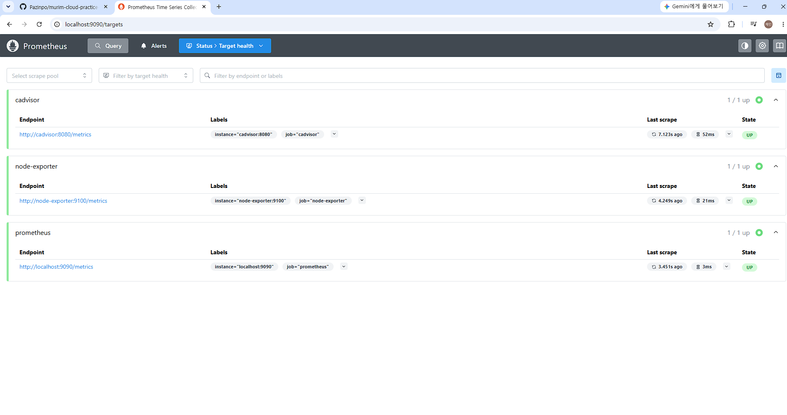
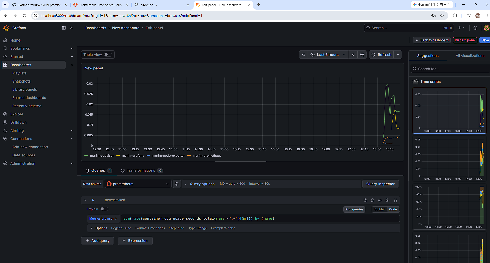
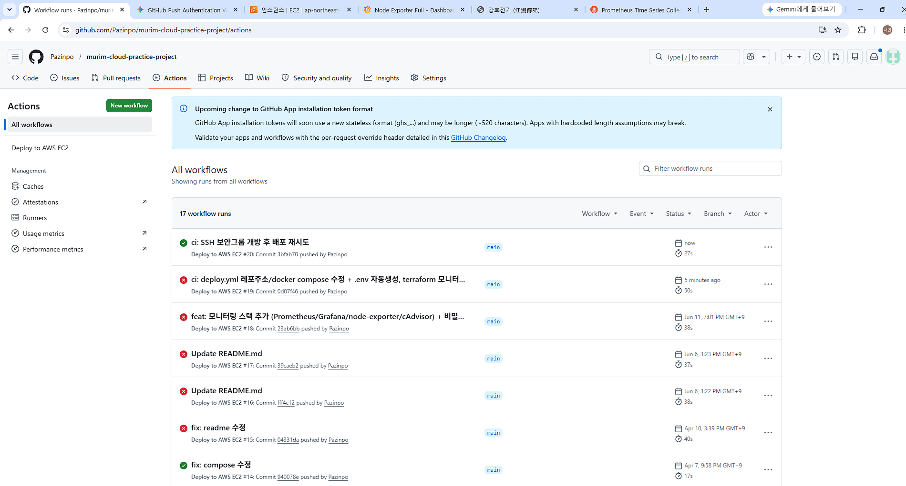
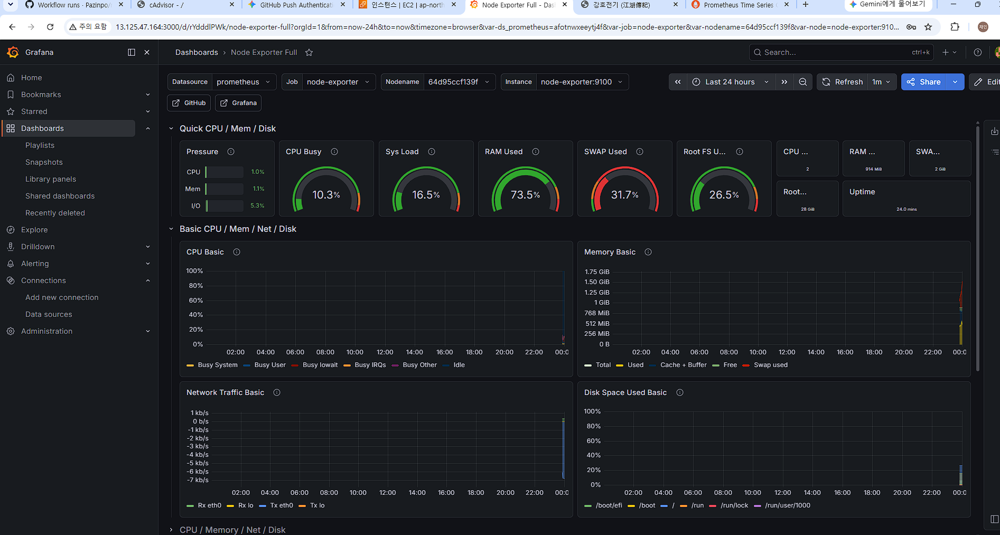

# Murim Cloud

AWS EC2 환경에서 Nginx, FastAPI, MariaDB를 Docker Compose로 운영하고,
Prometheus·Grafana 기반 모니터링/관제 환경을 구축하며,
GitHub Actions 기반 CI/CD와 Terraform 기반 IaC를 적용한 인프라 실습 프로젝트입니다.

## Project Overview

이 프로젝트는 단일 EC2 환경에서 웹 계층, 애플리케이션 계층, 데이터 계층을 분리 운영하고,
Prometheus·Grafana로 서버 및 컨테이너 메트릭을 수집·시각화하는 관제 환경을 구축했습니다.
또한 GitHub Actions를 통해 자동 배포를 수행하고, Terraform으로 AWS 인프라를 코드로 관리하는 것을 목표로 했습니다.

## Objectives

- 웹 / 애플리케이션 / 데이터 계층 분리 운영
- Prometheus·Grafana·node-exporter·cAdvisor 기반 모니터링/관제 환경 구축
- 호스트(서버) 및 컨테이너 단위 메트릭 수집·시각화
- GitHub Actions 기반 자동 배포 파이프라인 구축
- Terraform을 활용한 AWS 인프라 코드화
- 트러블슈팅 경험 문서화를 통한 운영 관점 강화

## Architecture

## Tech Stack

### Cloud / Infra
- AWS EC2
- VPC
- Public Subnet
- Internet Gateway
- Route Table
- Security Group
- Terraform

### Container / App
- Docker
- Docker Compose
- Nginx
- FastAPI
- MariaDB

### Monitoring
- Prometheus (메트릭 수집)
- Grafana (시각화 대시보드)
- node-exporter (호스트 메트릭)
- cAdvisor (컨테이너 메트릭)

### CI/CD
- GitHub Actions
- SSH
- GitHub Secrets

## Repository Structure

\`\`\`text
.
├── .github/
│   └── workflows/
│       └── deploy.yml
├── backend/
├── frontend/
├── terraform/
│   └── main.tf
├── monitoring/
│   └── prometheus.yml
├── docs/
├── docker-compose.yml
├── nginx.conf
└── README.md
\`\`\`

## Monitoring

Prometheus가 pull 방식으로 각 exporter의 메트릭을 주기적으로 수집(scrape)하고,
이를 Grafana로 시각화하는 관제 환경을 구성했습니다.

- **Prometheus**: 15초 주기로 등록된 타깃을 scrape하여 시계열 DB(TSDB)에 저장
- **node-exporter**: 호스트(EC2)의 CPU / 메모리 / 디스크 / 네트워크 등 OS 레벨 메트릭 수집
- **cAdvisor**: 컨테이너별 CPU / 메모리 / 네트워크 사용량 수집
- **Grafana**: Node Exporter Full(Dashboard ID 1860) 활용 및 PromQL 직접 작성 패널로 컨테이너 메트릭 시각화

컨테이너 간 통신은 Docker Compose 서비스명을 사용하므로, Prometheus의 scrape 타깃과
Grafana의 데이터소스 모두 \`localhost\`가 아닌 서비스명(\`prometheus:9090\`, \`node-exporter:9100\`, \`cadvisor:8080\`)으로 지정했습니다.

**Prometheus 타깃 수집 상태 (prometheus / node-exporter / cAdvisor 모두 UP)**

**PromQL을 직접 작성하여 구성한 컨테이너별 CPU 사용률 패널**

## Deployment

Terraform으로 인프라를 프로비저닝하고, EC2 \`user_data\`로 초기 배포까지 자동화한 뒤,
이후 변경 사항은 GitHub Actions로 지속 배포(CI/CD)되도록 구성했습니다.

1. **인프라 프로비저닝** — \`terraform apply\`로 VPC, Subnet, IGW, Route Table, Security Group, EC2 생성
2. **서버 초기화** — EC2 \`user_data\`가 Docker 설치, 2GB 스왑 설정, 프로젝트 clone, \`.env\` 생성, \`docker compose up -d\`까지 자동 수행
3. **지속 배포** — \`main\` 브랜치 push 시 GitHub Actions가 SSH로 EC2에 접속하여 \`git pull\` 후 \`docker compose up -d\`로 재배포

**GitHub Actions를 통한 자동 배포 성공**

**EC2에서 실제 동작하는 Grafana 대시보드 (퍼블릭 IP 접속)**

## Security

- 민감정보(DB·Grafana 비밀번호)를 \`.env\`로 분리하고 \`.gitignore\`로 형상관리에서 제외하여, 공개 저장소에서도 노출되지 않도록 처리
- DB(3306) 및 모니터링 포트(3000/9090/8081)는 본인 IP(\`/32\`)로만 접근 제한 — 최소 권한 원칙 적용
- SSH(22)는 CI/CD 자동 배포를 위해 개방하되, 비밀번호 인증을 사용하지 않고 키 기반 인증만 허용

## Access Points

| 서비스 | 포트 | 접근 범위 |
|--------|------|-----------|
| Nginx (Web) | 8085 | 공개 |
| Grafana | 3000 | 본인 IP |
| Prometheus | 9090 | 본인 IP |
| cAdvisor | 8081 | 본인 IP |
| MariaDB | 3306 | 본인 IP |

## Troubleshooting

프로젝트를 진행하며 마주친 운영 이슈와 해결 과정을 정리했습니다.

### 1. Terraform / AWS — EC2 재생성으로 인한 상태 변경
- **증상:** \`terraform apply\` 시 EC2가 파괴 후 재생성되어 공인 IP와 서버 상태가 변경됨
- **원인:** Immutable Infrastructure 특성상 일부 리소스 변경이 인스턴스 교체를 유발
- **해결:** 변경된 공인 IP를 GitHub Secrets(HOST)와 DB 접속 도구에 최신화하여 배포 파이프라인 정상화

### 2. Security Group — 포트 누락으로 인한 접근 차단
- **증상:** 80번 포트만 열려 있어 실제 서비스 포트(8085)와 DB 포트(3306) 접근이 차단됨
- **원인:** main.tf에 서비스/DB 포트에 대한 ingress 규칙 미정의
- **해결:** main.tf에 8085(Web), 3306(DB), 22(SSH) ingress 규칙을 추가해 인프라 설계와 런타임 포트의 일치 확인

### 3. Docker Network — 백엔드 DB 연결 실패
- **증상:** 백엔드에서 DB 연결 실패 (Connection Refused)
- **원인:** 컨테이너 내부에서 \`localhost\`로 DB에 접근 시도
- **해결:** 컨테이너 간 통신은 서비스명을 호스트로 사용해야 함을 확인하고, DB_HOST를 docker compose 서비스명(my-db)과 일치시킴

### 4. Data Persistence — 서버 재구축 후 데이터 소멸
- **증상:** 서버 재구축 후 DB 테이블과 데이터가 소멸
- **원인:** 인스턴스 파괴 시 로컬 볼륨 폴더도 함께 삭제됨
- **해결:** 데이터 영속성을 위해 운영 환경에서는 RDS 또는 EBS 분리 전략이 필요함을 정리

### 5. EC2 — 디스크 용량 부족으로 컨테이너 기동 실패
- **증상:** EC2 배포 시 \`no space left on device\`로 일부 이미지 추출 실패
- **원인:** t3.micro 기본 EBS(8GB)로는 모니터링 포함 7개 컨테이너 이미지 용량이 부족
- **해결:** Terraform \`root_block_device\`로 EBS를 30GB(프리티어 한도)로 확장하고, \`growpart\`·\`resize2fs\`로 OS 파일시스템까지 확장하여 해결

### 6. EC2 — 메모리 부족(OOM) 대응
- **증상:** t3.micro(RAM 1GB)에서 컨테이너 7개 동시 기동 시 메모리 부족 우려
- **원인:** 비용 절감을 위해 t3.micro를 유지했으나, RAM 부족 시 OOM Killer로 컨테이너가 강제 종료될 위험
- **해결:** user_data에 2GB 스왑 메모리 설정을 코드화하여 인스턴스 생성 시 자동 적용. Grafana 대시보드에서 SWAP 사용률이 실제 잡히는 것으로 검증 (인프라 자원은 AWS, 스왑은 OS 영역임을 구분하여 적용)

### 7. CI/CD — GitHub Actions SSH 접속 timeout
- **증상:** Actions 배포 시 \`dial tcp :22: i/o timeout\` 발생
- **원인:** SSH(22) ingress를 본인 IP로만 제한하여 GitHub Actions 러너의 IP가 차단됨
- **해결:** SSH 22번을 개방하되 키 기반 인증으로 보안을 확보. DB·모니터링 포트(3306/3000/9090/8081)는 본인 IP 제한을 유지하여 최소 권한 원칙을 함께 적용
